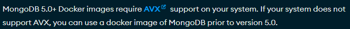
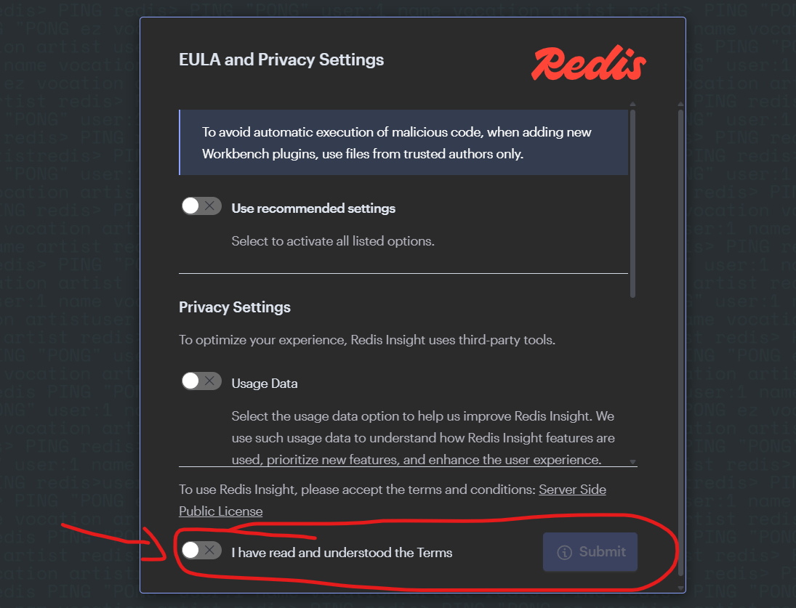

# Commercial Catalog
An application that simplifies managing a commercial catalog, regardless of the data schema.

Teste de Update Readme

## Applications wiki

[Link to applications wiki](https://wiki.internal.ctt.pt/en/Technology/Engenharia-de-Software/Aplica%C3%A7%C3%B5es/Overview)

## Main functionalities
- Store data in the schema you want
- API to create, update and delete entities and their data
- Register entities (Ex: countries, holidays, stores, etc.)
- Manage the data of each registered entity
- Register notifications for an entity
  - Every change made to a data point of an entity can trigger notifications to 1 or many destinations
  - Use this to notify other applications that need to know when data changes
  - Supported destinations:
    - Kafka topic
    - HTTP(S) webhook

# Application Architecture
[more information here](/documentation/architecture.md)

# Technical information
## Stack
This application uses the following technologies:
- C# .Net
- MongoDb
- Redis

The application also interacts with the following technologies:
- Kafka

# Developer information
## Requisites
To develop in this application you will need, at a minimum, to have installed in your system the following:
- [Docker](https://docs.docker.com/manuals/) with Compose
- [AVX](https://en.wikipedia.org/wiki/Advanced_Vector_Extensions) support in your system 

## Local development environment
This repository contains a local development environment, fully containerised, that can be used to run the application on your machine and test it.<br><br>
The services available in the local development environment are configured at `setup/local/docker-compose.yml` and `setup/local/docker-compose.elk.yml`.<br>
**NOTE:** Any service assigned with the profile `only_if_not_cicd` will not be started in a **CICD** environment.<br><br>

**NOTE:** Use of a unix command line environment is recommended.

### Run the local environment
**Required setup:**
The local environment requires the following environment variables to be configured ([more information](#configure-the-local-environment)):
- LD_ENV_SDK_KEY
- LD_CONTEXT_API_KEY

To run the local environment follow these steps:

1. From the root of the project run the command
```sh
sh cli/start.sh [flags] [services]
```
Where:

**flags:**<br>
Any flag supported by the `Docker compose up` command.<br>
For more information consult the official Docker [documentation](https://docs.docker.com/reference/cli/docker/compose/up/).<br>
**NOTE:** Consider using the `-d` flag, which runs the Docker project in detached mode.

**services:**<br>
Whitespace separated list of services to run.<br>
The available services are declared in the local environment Docker compose project at `setup/local/docker-compose.yml`.<br>
**NOTE:** If no services are provided, all services will be started.

This will run a Docker compose project and start several networked Docker containers will all the services and necessary tools to use the application.

The following services will be running in the containers:
- CommercialCatalog API Service
- CommercialCatalog DbListener Service
- CommercialCatalog Notification Service
- MongoDb 1 node replica set
- 2 Redis single node instances (used by the DbListener and Notification services)
- Confluent community edition Kafka Broker
- Confluent Schema Registry
- A GUI for MongoDb
- A GUI for Redis
- A GUI for Kafka
- A mock webhook server

There will also be a stopped container named `db_init` which sets up the MongoDb replica set and exits.

2. **[OPTIONAL]** From the root of the project run the command
```sh
sh cli/start_elk.sh [services]
```
Where:

**services:**<br>
Whitespace separated list of services to run.<br>
The available services are declared in the local environment ELK Docker compose project at `setup/local/docker-compose.elk.yml`.<br>
**NOTE:** If no services are provided, all services will be started.

This will run a Docker compose project and start several networked Docker containers will all the services and necessary tools to use an ELK stack.

The following services will be running in the containers:
- 1 Elasticsearch instance
- 1 Kibana instance
- 1 OTEL Collector instance

**NOTE:** Elasticsearch takes a few minutes to start and be ready to receive information, which means if you send logs before it is ready then those logs will be lost.<br>
In order to confirm if the ELK stack is ready run the command
```sh
docker ps -a
```
And check if the `elasticsearch` service is `healthy`.

3. Interact with the local environment via the following URLs:

`MongoDb GUI`: [http://localhost:9000](http://localhost:9000) (user: appUser | pw: appPw)

`Redis GUI`: [http://localhost:9001](http://localhost:9001)<br>
**NOTES:**<br>
Accept the T&C and submit to enter.


Add the following databases:<br>
`redis://default@dblistener_db:6379`<br>
`redis://default@notification_db:6379`

`Kafka GUI`: [http://localhost:9002](http://localhost:9002)<br>
**NOTES:**<br>
Add a topic with the name `catalog` with, at least, 1 partition.<br>
Add a schema with the subject `catalog-value`, the content of the file `setup/local/kafka_schema_json.json` and the type `JSON`.

`Kibana`: [http://localhost:9003](http://localhost:9003)

`CommercialCatalog API`: [http://localhost:10000](http://localhost:10000)<br>
Use the Postman collection at `setup/local/Commercial Catalogue.postman_collection` to interact with the application.

`CommercialCatalog API Swagger UI`: [http://localhost:10000/swagger](http://localhost:10000/swagger)

### Stop the local environment
From the root of the project run the command
```sh
sh cli/stop.sh
```
This will stop the Docker compose project and cleanup its resources.

### Configure the local environment
To configure some of the parameters of the local environment follow these steps:

1. Copy the file `setup/local/.env.template` to `setup/local/.env`
2. Fill in the parameters you want to overwrite and delete the ones you want to keep the defaults
3. Run the local environment

## Testing the application
From the root of the project run the command
```sh
sh cli/test.sh [flags] [projects]
```
Where:

**flags:**
- `-w`: Run the tests in watch mode (Requires at least 1 project to be specified)
- `--unit`: Run only unit tests
- `--integration`: Run only integration tests
- `--e2e`: Run only end to end tests
- `--docker`: Run the tests in a Docker container
- `--filter`: Run only the tests that match the provided [xunit filter](https://learn.microsoft.com/en-us/dotnet/core/testing/selective-unit-tests?pivots=xunit)
- `--coverage`: Run the unit tests with coverage report using the [coverlet collector](https://github.com/coverlet-coverage/coverlet)

**projects:**<br>
Whitespace separated list of test `.csproj` to run.

**NOTES:**<br>
- When running the tests with the flags `--docker` or `--cicd`, the tests will run inside a Docker container that will be in the `myapp_shared` network.
- When running the script with the flags ``--integration` or `--e2e` the flag `--docker` is assumed as well, which means the tests will run inside a Docker container.

### Generating test coverage reports
To generate unit test coverage reports, including an HTML report, from the root of the project run the command
```sh
sh cli/coverage.sh [flags]
```
Where:

**flags:**
- `--docker` Build the coverage report in a Docker container

Each test project's coverage report will be located inside a directory named `TestResults`, inside each test project's directory.

The HTML coverage report is located inside the directory `./coverageReport`, which contains an `index.html` file.

## Project dependencies update validations
To check for updates to the project dependencies and update them if needed, from the root of the project run the command
```sh
sh cli/dependencies_update.sh [flags]
```
Where:

**flags:**
- `-u` | `--update`: Update all outdated dependencies. You will be prompted for each one for confirmation before updating
- `-y`: Update all dependencies without prompting

If the update flag is not provided, the script will print the report with all the dependencies that are outdated, but will not update any of them.

## Security & Compliance Notes

[more information here](/documentation/security.md)

## CI/CD
[more information here](/documentation/cicd.md)
