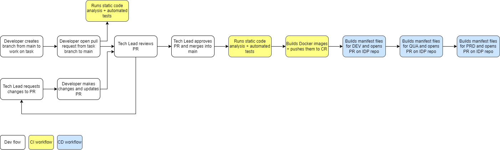

# CI/CD

This project uses the reusable pipeline templates for Docker build artifacts located at [https://github.com/CorreiosPortugal/pt.technology.pipeline-templates.actions](https://github.com/CorreiosPortugal/pt.technology.pipeline-templates.actions) and follows the work flow below.

The CI/CD pipeline has the following triggers:

`Pull request`
- `opened`, `edited`, `reopened` and `synchronize` will trigger:
  - CI workflow's static code analysis and automated tests
- `closed` with a merge to the `main` branch will trigger:
  - CI workflow's static code analysis and automated tests
  - CI workflow's build of the Docker images and push to the remote container registry
  - CD workflow's build of the manifest files for the `dev` environment and open a PR on the IDP's dev repo
  - CD workflow's build of the manifest files for the `qua` environment and open a PR on the IDP's qua repo
  - CD workflow's build of the manifest files for the `prd` environment and open a PR on the IDP's prd repo